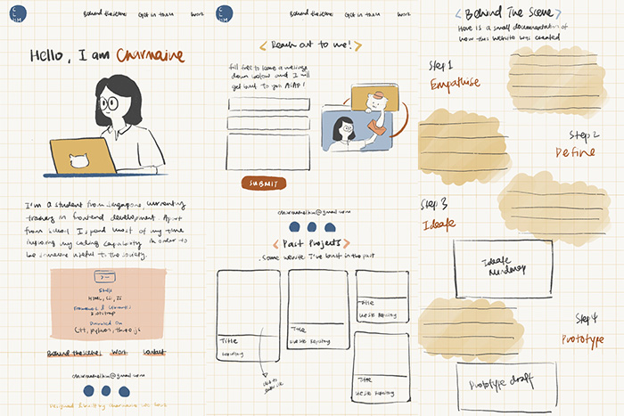

# Charmaine's E-Portfolio

This is a microsite built for a school project about user experience design and web technoloogies. This site serves as my e-portfolio to allow visitors to know more about me and what I do, as well as a place to showcase my past projects.

### Technical Used

These are the cool friends that helped made my application possible

Built using:

- HTML
- Vanilla CSS and JavaScript
- Bootstrap

## Development Process

As part of the project's requirement, design thinking was applied for the creation of this site.

### Step 1: Empathise

#### Who are the target audiences? What is it that they want to know? What is the purpose of this site?

Potential recruiter:

- Know more about who I am and whether I am suitable for the job
- Any past work experiences?
- Contact details and other platforms that I am on
- Having to go through multiple candidate portfolios can cause weariness

Myself:

- A representation of myself
- A place for others to get to more about me

### Step 2: Define

#### Analysing information gathered from step 1, these are the problems that need to be solved, and things that should be prioritised:

- Portfolio should represent who I am and demonstrate the technical and soft skills I possess as these are some factors potential recruiters look for when searching for a suitable job candidate.
- Portfolio should be simple and easy to navigate around as recruiters are often fatigue after looking through numerous portfolios.

### Step 3: Ideate

#### Problems defined previously served as the anchor on how the portfolio should be designed and the types of features required:

Firstly, how can the audiences know more about my technical and soft skills?

- Exhibit past projects
  - Information like the technologies used for each project and the links to both the repository and live site should be included
- A table that display all technical skills
  - To be found on the main landing page
- Link audiences to other platforms that they can find me on
  - Took inspiration from social buttons that can be found on many sites that brings users to their social media platforms
  - Platforms to be included: LinkedIn, GitHub, Twitter

Secondly, how can I represent myself through the portfolio?

- Using customised fonts and hand-drawn illustrations to give a personal touch to the portfolio
- Using of rounded corners to excude a welcoming and harmonious energy
  - for elements like buttons, borders, etc
- Create a colour palette that can create a brand identity
  - Having blue as the primary colour (my favourite color)
  - Should include some shades of orange to excude playful and positive energy

Thirdly, how should the portfolio be structured so that it's easy to navigate through?

- Past projects can be displayed in a card form to create an organised structure that is easy to understand
- as the portfolio consists of multiple subpages, there should be a way to inform users about the page they are at

### Step 4: Prototype

Sketches were created to explore the different ways of displaying information

A low-fidelity prototype was then drawn to test out feasibility of the design

### Step 5: Test and Implementation

#### Continuous testing done throughout the building of portfolio to ensure its usability

Some items that were only implemented after the implementation phase include:

- "Home" tab on the navigation bar that allows users to return to the landing page easily
- "Return to top" button as a shortcut for users to go back to the top of the page if they want to explore other sub-pages
